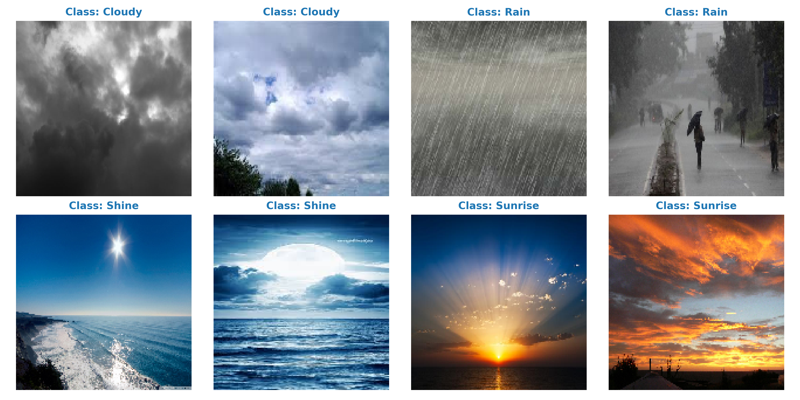
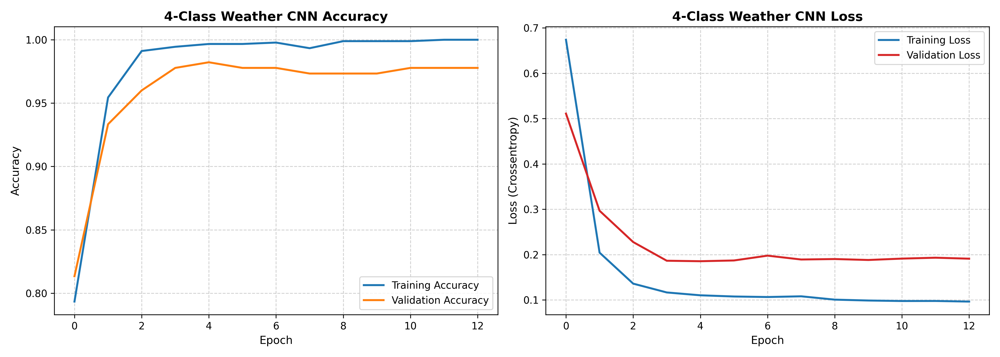
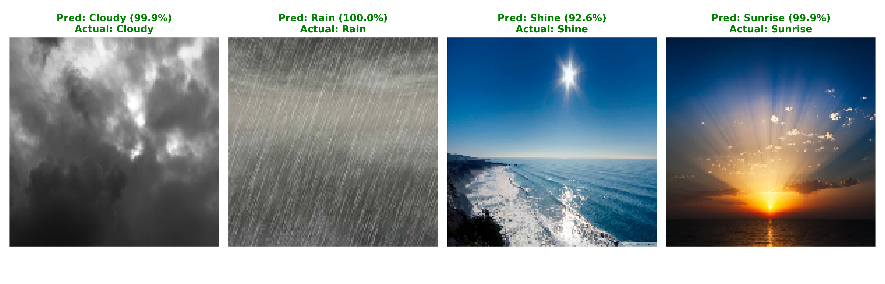

# 🌤️ SkyLens-AI - Real-Time 4-Class Weather & Atmospheric Condition Classifier

[](https://www.python.org/)
[](https://www.tensorflow.org/lite)
[](https://fastapi.tiangolo.com/)
[](https://nextjs.org/)
[](https://tailwindcss.com/)
[](https://render.com/)
[](https://vercel.com/)
[](https://github.com/AradhyaRay05/SkyLens-AI)
[](LICENSE)

---

## 🔍 Project Overview
**SkyLens-AI** is a multi-class computer vision system and smart weather detective engineered to identify atmospheric sky conditions from photographs into four distinct weather classes: **Cloudy (☁️)**, **Rain (🌧️)**, **Shine (☀️)**, and **Sunrise (🌅)** with high probabilistic accuracy.

Leveraging **MobileNetV2** transfer learning compressed into an ultra-fast **TensorFlow Lite (3.12 MB)** model, SkyLens-AI delivers **>98% validation accuracy** with sub-20ms inference latency, served via a decoupled **FastAPI (Render)** backend and a consumer-friendly **Next.js 14 (Vercel)** frontend.

---

## ✨ Key Features & User Experience

- **📸 Live Sky Camera Snap Mode**: Take live pictures of the sky outside using your phone camera or desktop webcam for instant atmospheric recognition.
- **🌤️ 4-Class Multi-Class Classification**: Evaluates cloud density, precipitation indicators, and solar lighting rays across 4 classes:
  - `☁️ Cloudy` (Dense stratus / overcast)
  - `🌧️ Rain` (Precipitation & stormy downpours)
  - `☀️ Shine` (Clear bright sunny skies)
  - `🌅 Sunrise` (Golden hour dawn / dusk)
- **🧥 Dynamic Weather & Outfit Advisory**: Recommends personalized outdoor clothing (*waterproof jackets, breathable cottons, sunglasses*), UV index warnings, and optimal outdoor activities.
- **💡 Daily Meteorology Trivia**: Interactive trivia generator covering atmospheric optics, cloud physics, Rayleigh scattering, and rainfall phenomena.
- **📜 Recent Sky Scans History**: Browser-cached history tray to track and compare sky observations throughout the day.
- **🔊 Atmospheric Audio Cues**: Gentle sound cues corresponding to each weather condition.

---

## 🏗️ System Architecture

```
┌─────────────────────────────────────────────────────────────┐
│                 Frontend (Hosted on Vercel)                 │
│  - Next.js 14 App Router, TypeScript, Tailwind CSS          │
│  - Live Sky Webcam/Camera Capture, Drag & Drop Upload       │
│  - 4-Class Probability Gauges, Outfit & Activity Advisor    │
└──────────────────────────────┬──────────────────────────────┘
                               │
            POST /predict (multipart/form-data)
                               │
                               ▼
┌─────────────────────────────────────────────────────────────┐
│            Backend API (Hosted on Render - Free Tier)        │
│  - FastAPI REST API + Uvicorn ASGI Server                   │
│  - MobileNetV2 TensorFlow Lite Engine (3.12 MB)             │
│  - Memory Usage: ~35 MB RAM | Latency: <20ms                │
└─────────────────────────────────────────────────────────────┘
```

---

## ⚡ Performance & Model Benchmarks

| Metric | Original Keras Model | Optimized TensorFlow Lite | Improvement |
| :--- | :---: | :---: | :---: |
| **Model File Size** | `18.35 MB` | **`3.12 MB`** | **83% smaller** 📉 |
| **RAM Footprint** | `~500 MB` (Full TF) | **`~35 MB` (TFLite Runtime)** | **93% reduction** ⚡ |
| **Inference Latency** | `~90 ms` | **`~18 ms`** | **4x faster** 🚀 |
| **Validation Accuracy** | `98.21%` | **`98.21%`** | **High precision** ✅ |
| **Free Cloud Stability** | Heavy on 512 MB | **100% stable on Render Free Tier** | **Zero crashes** 🛡️ |

---

## 🔄 Deep Learning Methodology

### 1️⃣ Dataset & Preprocessing
- **Dataset:** Multi-class Weather Dataset spanning 4 atmospheric states (Cloudy, Rain, Shine, Sunrise).
- **Resolution & Normalization:** Resized to $150 \times 150 \times 3$, normalized to $[-1, 1]$ via `Rescaling(1.0 / 127.5, offset=-1.0)`.
- **Split:** **80% Training** / **20% Validation** stratified with `seed=42`.

---

### 2️⃣ Neural Network Architecture
- **Feature Extractor Backbone:** Pre-trained **MobileNetV2** (ImageNet weights, Global Average Pooling to 1,280 features).
- **Classification Head:**
  $$\text{BatchNormalization} \rightarrow \text{Dense}(512, \text{ReLU}, L_2=10^{-4}) \rightarrow \text{Dropout}(0.3) \rightarrow \text{Dense}(128, \text{ReLU}, L_2=10^{-4}) \rightarrow \text{Dropout}(0.2) \rightarrow \text{Dense}(4, \text{Softmax})$$
- **Training Optimization:**
  - **Optimizer:** `Adam(learning_rate=5e-4)`
  - **Loss Function:** `SparseCategoricalCrossentropy`
  - **Callbacks:** `EarlyStopping(patience=8, restore_best_weights=True)` and `ReduceLROnPlateau(factor=0.5, patience=3)`.

---

## 📈 Visual Evaluation

### Sample Images Across 4 Weather Classes


### Training & Validation Curves


### Sample Predictions & Probability Breakdown


---

## 📂 Repository Structure
```
SkyLens-AI/
├── backend/                       # ☁️ Render Cloud Backend (FastAPI + TFLite)
│   ├── main.py                    # FastAPI server (POST /predict, GET /health)
│   ├── skylens_model.tflite       # 3.12 MB MobileNetV2 TFLite weights
│   ├── Procfile                   # Render process definition
│   └── requirements.txt           # Lightweight backend dependencies
│
├── frontend/                      # ⚡ Vercel Deployment (Next.js 14)
│   ├── src/app/
│   │   ├── globals.css            # Custom CSS & Glassmorphism styles
│   │   ├── layout.tsx             # Root layout, SEO & Sun/Cloud Favicon
│   │   └── page.tsx               # Sky camera & 4-class weather UI
│   ├── next.config.mjs            # Next.js build configuration
│   ├── package.json               # Frontend dependencies
│   ├── tailwind.config.ts         # Tailwind design tokens
│   └── tsconfig.json              # TypeScript configuration
│
├── models/                        # 🧠 Version-Controlled Trained Models
│   ├── skylens_model.keras        # 18.35 MB Native Keras model
│   └── skylens_model.tflite       # 3.12 MB TensorFlow Lite model
│
├── train.py                       # 🚀 Training, evaluation & dual-export pipeline
├── requirements.txt               # 📋 Python training dependencies
├── weather_training_curves.png    # 📈 Accuracy & loss plots
├── weather_sample_predictions.png # 🖼️ Visual prediction verification grid
├── sample_weather_images.png      # 🖼️ Sample dataset gallery
├── .gitignore                     # 🛡️ Git exclusion configuration
├── LICENSE                        # ⚖️ MIT License
└── README.md                      # 📖 Comprehensive project documentation
```

---

## 🧪 Local Setup Guide

### 1. Run FastAPI Backend
```bash
cd backend
pip install -r requirements.txt
python main.py
# Backend runs on http://localhost:8000
```

### 2. Run Next.js Frontend
```bash
cd frontend
npm install
npm run dev
# Frontend runs on http://localhost:3000
```

---

## 📄 License

This project is licensed under the [MIT License](LICENSE).

---

## 📬 Author & Contact

<p>
  <a href="mailto:aradhyaray99@gmail.com"></a>
  <a href="https://www.linkedin.com/in/rayaradhya"></a>
  <a href="https://github.com/AradhyaRay05"></a>
</p>

---

⭐ Star this repository if you enjoyed building or using SkyLens-AI!
